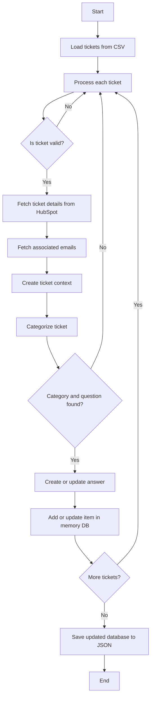

# HubSpot Tickets to Knowledge Base Articles



## Prerequisites

- Node.js (version 20 or higher recommended)
- HubSpot API access
- Anthropic API access

## Dependencies

- @fast-csv/parse
- @hubspot/api-client
- @langchain/anthropic
- @langchain/core
- dotenv
- zod

## Installation

Install NPM packages:
```bash
npm install --save langchain @langchain/core @langchain/anthropic @fast-csv/parse @hubspot/api-client zod dotenv
```

Create a `.env` file in the project root and add your Anthropic and HubSpot API keys:
```bash
ANTHROPIC_API_KEY=your_api_key
HUBSPOT_API_KEY=your_api_key
```

## Usage

1. Export your HubSpot tickets to a CSV file and save it in the project directory.
Use [this guide](https://knowledge.hubspot.com/import-and-export/export-records) to export tickets from HubSpot

2. Save the exported CSV file as `tickets.csv` in the project directory.

3. Run the main script to process tickets and generate the knowledge base:

    ```bash
    node index.mjs
    ```

4. Convert the generated JSON file to a CSV file:
    ```bash
    node json2csv.mjs
    ```

## Main Components

- `main.mjs`: The entry point of the application, orchestrating the ticket processing workflow.
- `utils.mjs`: Utility functions for loading CSV files and saving JSON data.
- `memdb.mjs`: In-memory database for storing and managing knowledge base items.
- `lc-utils.mjs`: Language model utilities for categorizing tickets and generating answers.
- `hs-utils.mjs`: HubSpot API utilities for fetching ticket and email data.

## Notes

- The project uses Claude 3.5 Sonnet (2024-06-20) for natural language processing tasks.
- Processed data is saved as a JSON file in the project directory.
- Make sure to handle the HubSpot API key securely and do not commit it to version control.
